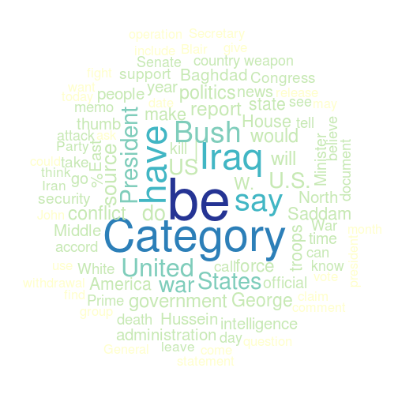

Comparing corpora
-----------------

It can be interesting to compare vocabulary use in two corpora. For instance, to find out:
- which terms certain actors are more/less likely to use compared to other actors.
- which terms are more/less common in texts about certain actors/issues compared to other actors/issues.
- whether the use of certain terms has increased/decreased between two periods in time.

In this howto we demonstrate how to compare vocabulary use in two corpora, and offer a function to do so conveniently. 
For data we use wikinews articles about Iraq.


```r
library(corpustools)
```

```
## Loading required package: slam
## Loading required package: Matrix
## Loading required package: lda
## Loading required package: tm
## Loading required package: reshape2
## Loading required package: topicmodels
## Loading required package: RColorBrewer
## Loading required package: wordcloud
## Loading required package: Rcpp
```

```r
data("wikinews_iraq")
iraq.dtm
```

```
## A document-term matrix (674 documents, 10707 terms)
## 
## Non-/sparse entries: 68649/7147869
## Sparsity           : 99%
## Maximal term length: 369 
## Weighting          : term frequency (tf)
```

```r
head(iraq.meta)
```

```
##         id       date   medium length       year      month       week
## 1 81112681 2013-08-29 Wikinews    406 2013-01-01 2013-08-01 2013-08-26
## 2 81112682 2012-01-20 Wikinews    149 2012-01-01 2012-01-01 2012-01-16
## 3 81112683 2011-02-06 Wikinews    486 2011-01-01 2011-02-01 2011-01-31
## 4 81112684 2010-09-23 Wikinews    314 2010-01-01 2010-09-01 2010-09-20
## 5 81112685 2013-08-30 Wikinews    394 2013-01-01 2013-08-01 2013-08-26
## 6 81112686 2009-08-12 Wikinews    244 2009-01-01 2009-08-01 2009-08-10
```


For example, lets split our corpus into those articles that mention Bush and those that do not:


```r
ncol(iraq.dtm)
```

```
## [1] 10707
```

```r
w = as.matrix(iraq.dtm[, "Bush"])
dtm.bush = iraq.dtm[w > 0, ]
dtm.rest = iraq.dtm[w == 0, ]
```


To compare two corpora, the function `compare.corpora` is provided. 
This gives a list of the words that occur 'too much' in the articles mentioning Bush,
or in other words the collocates of the word 'Bush'.
The following example selects all words that are overrepresented in the `bush` corpus,
and sorts them by chi-squared:


```r
terms = corpora.compare(dtm.bush, dtm.rest)
over = terms[terms$over > 1, ]
over = over[order(-over$chi), ]
head(over)
```

```
##                term termfreq.x termfreq.y relfreq.x relfreq.y   over
## 541            Bush        311          0  0.013227 0.0000000 14.227
## 2830      President        177         75  0.007528 0.0008940  4.503
## 1531         George         92         14  0.003913 0.0001669  4.210
## 3920             W.         78          5  0.003317 0.0000596  4.074
## 80   administration         67         14  0.002849 0.0001669  3.299
## 3937            war        155        131  0.006592 0.0015615  2.964
##         chi
## 541  1112.9
## 2830  345.3
## 1531  261.4
## 3920  252.4
## 80    175.4
## 3937  175.0
```


To list the underrepresented words, simply reverse the filter:


```r
under = terms[terms$over < 1, ]
under = under[order(-under$chi), ]
head(under)
```

```
##         term termfreq.x termfreq.y relfreq.x relfreq.y   over   chi
## 3406 soldier         22        326 0.0009357  0.003886 0.3962 49.49
## 2052    kill         58        512 0.0024667  0.006103 0.4881 46.00
## 304   attack         45        415 0.0019138  0.004947 0.4900 39.61
## 362  Baghdad         69        532 0.0029345  0.006341 0.5360 38.31
## 2779  police          8        193 0.0003402  0.002300 0.4061 37.78
## 643   charge          7        148 0.0002977  0.001764 0.4695 27.41
```


What can be seen from these two word lists is that the articles mentioning Bush are more political in nature,
while the other articles describe more (military) action. 

Word clouds
-----------

We can also create a word cloud from these terms. In this case, we specify a square root transformation of the frequencies to make the smaller terms visible. 


```r
dtm.wordcloud(dtm.bush, freq.fun = sqrt)
```

 


Another option is to base the word cloud not on the most common terms in the articles mentioning Bush, but rather on the most typical words. This can be done by basing the word cloud on the overrepresentation or chi-square values rather than the frequency:


```r
dtm.wordcloud(terms = under$term, freqs = under$chi)
```

 


Combining with metadata
-----

Of course, this can also be used to compare e.g. vocabulary differences between newspapers, speakers, periods, etc.
For example, the following uses the article metadata to compare vocabulary after 2012 with the vocabulary before that date.


```r
iraq.meta = iraq.meta[match(rownames(iraq.dtm), iraq.meta$id), ]
dtm.before = iraq.dtm[iraq.meta$date < as.Date("2012-01-01"), ]
dtm.after = iraq.dtm[iraq.meta$date >= as.Date("2012-01-01"), ]
terms = corpora.compare(dtm.after, dtm.before)
terms = terms[order(-terms$chi), ]
head(terms[terms$over > 1, ])
```

```
##        term termfreq.x termfreq.y relfreq.x relfreq.y  over    chi
## 3812  Islam        230          4  0.003708 8.813e-05 4.327 158.02
## 7006  Sunni        196          0  0.003160 0.000e+00 4.160 143.70
## 7759 weapon        138         19  0.002225 4.186e-04 2.273  58.60
## 7422 Turkey         83          3  0.001338 6.610e-05 2.193  53.02
## 7         %        142         27  0.002290 5.949e-04 2.063  47.91
## 5287  Party        109         16  0.001757 3.525e-04 2.039  44.50
```

```r
head(terms[terms$over < 1, ])
```

```
##            term termfreq.x termfreq.y relfreq.x relfreq.y   over   chi
## 6747    soldier        127        221 2.048e-03 0.0048691 0.5193 64.60
## 2836       Ford          1         40 1.612e-05 0.0008813 0.5401 51.41
## 5851       rape          2         36 3.225e-05 0.0007932 0.5757 42.91
## 4843     murder         24         68 3.870e-04 0.0014982 0.5552 37.82
## 3925 journalist         57        108 9.190e-04 0.0023795 0.5679 36.44
## 3604   incident         41         88 6.611e-04 0.0019388 0.5652 35.67
```


So, the latter articles mention the Islam and Turkey more frequently, 
while the earlier articles feature the war crimes reported by journalist Ford. 
