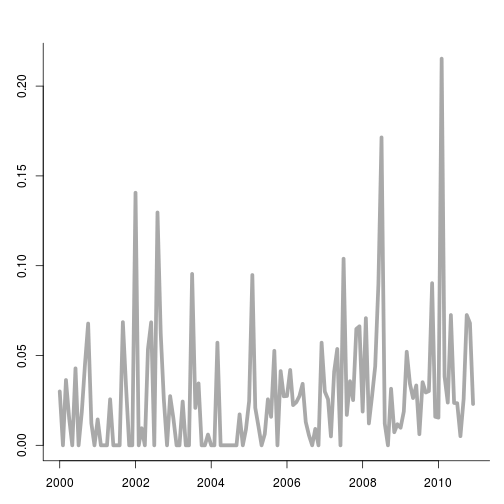
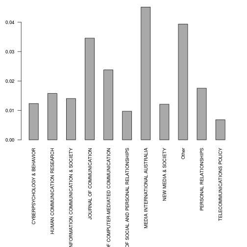
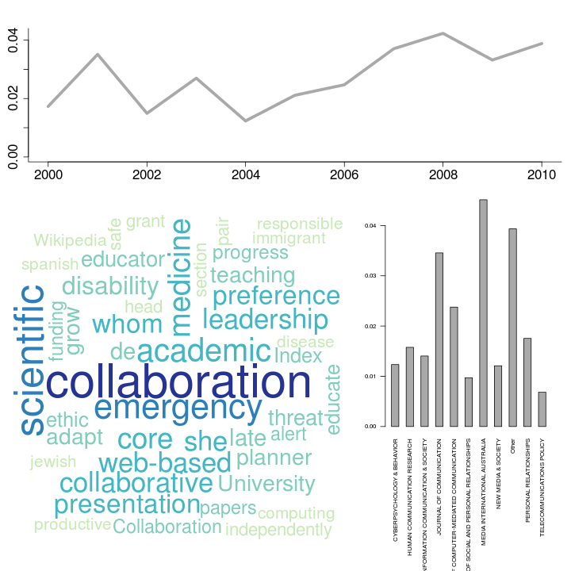
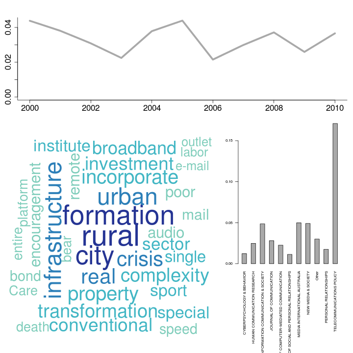
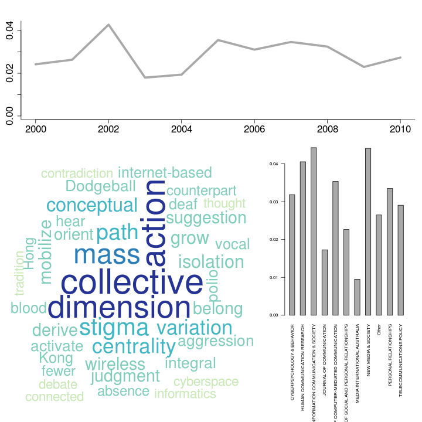

Latent Dirichlet Allocation
========================================================

Topic modelling techniques such as Latent Dirichlet Allocation (LDA) can be a usefull tool for social scientists to analyze large amounts of natural language data. Algorithms for LDA are available in R, for instance in the `lda` package. In this howto we demonstrate several function in the `corpustools` package that we developed to facilitate the use of LDA, based on the `lda` package.

As a starting point we use a Document Term Matrix (dtm) in the `DocumentTermMatrix` format offered in the `tm` package. Note that we also offer a howto for creating the dtm. 


```r
library(corpustools)
```

```
## Loading required package: slam
## Loading required package: Matrix
## Loading required package: lda
## Loading required package: tm
## Loading required package: topicmodels
## Loading required package: RColorBrewer
## Loading required package: wordcloud
## Loading required package: Rcpp
```

```r
load("wos_comsci_dtm.rdata")  ## Abstracts in 10 communication sciences journals from Web of Science, with 'social network' as a topic, from 2000 till 2010
dtm
```

```
## A document-term matrix (848 documents, 9753 terms)
## 
## Non-/sparse entries: 84132/8186412
## Sparsity           : 99%
## Maximal term length: 80 
## Weighting          : term frequency (tf)
```


Not all terms are equally informative of the underlying semantic structures of texts, and some terms are rather useless for this purpose. For interpretation and computational purposes it is worthwhile to delete some of the less usefull words from the dtm before fitting the LDA model. We offer the `term.statistics` function to get some basic information on the vocabulary (i.e. the total set of terms) of the corpus.


```r
termstats = term.statistics(dtm)
termstats[sample(1:nrow(termstats), 10), ]
```

```
##                      term characters number nonalpha termfreq docfreq
## slough             slough          6  FALSE    FALSE        1       1
## symposium       symposium          9  FALSE    FALSE        1       1
## person             person          6  FALSE    FALSE       39      32
## subscription subscription         12  FALSE    FALSE        5       2
## head                 head          4  FALSE    FALSE        7       3
## gene                 gene          4  FALSE    FALSE        4       3
## Consent           Consent          7  FALSE    FALSE        1       1
## health             health          6  FALSE    FALSE      418     141
## pair                 pair          4  FALSE    FALSE        7       5
## Blair               Blair          5  FALSE    FALSE        2       1
##              reldocfreq   tfidf
## slough         0.001179 0.06899
## symposium      0.001179 0.04699
## person         0.037736 0.02868
## subscription   0.002358 0.11690
## head           0.003538 0.09280
## gene           0.003538 0.06557
## Consent        0.001179 0.02939
## health         0.166274 0.03681
## pair           0.005896 0.05778
## Blair          0.001179 0.11246
```


We can now filter out words based on this information. In our example, we filter on terms that occur at least in two documents and that do not contain numbers. We also select only the 3000 terms with the highest tf-idf score (this is not a common standard. For large corpora it makes sense to include more terms). 


```r
termstats = termstats[termstats$docfreq > 1 & termstats$number == F, ]
voca = as.character(termstats[order(termstats$tfidf, decreasing = T), ][1:3000, 
    "term"])
filtered_dtm = dtm[, voca]  # select only the terms we want to keep
```


Now we are ready to fit the model! We made a wrapper called `lda.fit` for the `lda.collapsed.gibbs.sampler` function offered in the `lda` package. This wrapper performs two convenient steps in addition to fitting the model: 
- It transforms the dtm to the input format required for lda.collapsed.gibbs.sampler (which is a bit unusual)
- The output of `lda.collapsed.gibbs.sampler` does not contain the document ids, but only keeps the documents in the same order as the dtm. We therefore add the dtm to the output (which is a list of objects), so that it remains clear which documents are which. 

The main input for `lda.fit` is:
- the document term matrix
- K: the number of topics (this has to be defined a priori)
- Optionally, it can be usefull to increase the number of iterations. This takes more time, but increases performance (to some point)


```r
m = lda.fit(filtered_dtm, K = 30, num.iterations = 1000)
top.topic.words(m$topics)[, 1:4]
```

```
##       [,1]            [,2]            [,3]           [,4]          
##  [1,] "collaboration" "political"     "mobile"       "%"           
##  [2,] "medical"       "exposure"      "phone"        "symptom"     
##  [3,] "scientific"    "opinion"       "diffusion"    "physician"   
##  [4,] "academic"      "politics"      "adoption"     "agent"       
##  [5,] "medicine"      "indirect"      "usage"        "percent"     
##  [6,] "core"          "sphere"        "category"     "p"           
##  [7,] "planning"      "democratic"    "innovation"   "caregiver"   
##  [8,] "grow"          "choice"        "contact"      "psychosocial"
##  [9,] "region"        "scholar"       "african"      "density"     
## [10,] "actual"        "debate"        "geographic"   "score"       
## [11,] "practitioner"  "heterogeneity" "e-mail"       "domestic"    
## [12,] "complexity"    "selective"     "connectivity" "/"           
## [13,] "planner"       "democracy"     "reality"      "cite"        
## [14,] "official"      "argument"      "third"        "ci"          
## [15,] "adapt"         "choose"        "adopter"      "return"      
## [16,] "record"        "press"         "file"         "hear"        
## [17,] "de"            "ideological"   "editorial"    "satisfaction"
## [18,] "expansion"     "vote"          "adopt"        "<"           
## [19,] "discipline"    "institute"     "homophily"    "exploratory" 
## [20,] "syndrome"      "bias"          "recovery"     "shyness"
```


We now have a fitted lda model. The top.topic.words function shows the most prominent words for each topic (we only selected the first 4 topics for convenience). 

One of the thing we can do with the LDA topics, is analyze how much attention they get over time, and how much they are used by different sources (e.g., people, newspapers, organizations). To do so, we need to match this article metadata. Since the output of `lda.fit` is already a list, we prefer to add this metadata to the list as well, so that we have everything we need neatly in one place. To do so, we can match vectors of metadata to the document ids contained in the dtm (as rownames)


```r
load("wos_comsci_meta.rdata")
colnames(meta)  # the id column matches the rownames of the dtm
```

```
## [1] "id"            "date"          "journal"       "length"       
## [5] "journal.top10"
```

```r
m$meta = meta[match(rownames(m$dtm), meta$id), ]
names(m)
```

```
##  [1] "assignments"      "topics"           "topic_sums"      
##  [4] "document_sums"    "document_expects" NA                
##  [7] NA                 NA                 NA                
## [10] NA                 "dtm"              "meta"
```


We can now do some plotting. First, we can make a wordcloud for a more fancy (and actually quite informative and intuitive) representation of the top words of a topic.


```r
lda.plot.wordcloud(m, 1)
```

 


With `lda.plot.time` and `lda.plot.category`, we can plot the salience of the topic over time and for a given categorical variable.


```r
lda.plot.time(m, 1, m$meta$date, date_interval = "month", value = "relative")
```

 

```r
# Sidenote: the `return.values` argument can be set to TRUE to also let the
# function output the values that are plotted.
```


In our example data, we can use the names of the journals as categories. However, since there are so many journals, this becomes messy. We therefore only look at the top.10 most frequent journals (in our sample) and categorize the rest as `other`.


```r
lda.plot.category(m, 1, m$meta$journal.top10, value = "relative")
```

 

```r
# Sidenote: the `return.values` argument can be set to TRUE to also let the
# function output the values that are plotted.
```


Finally, it can be usefull to print all this information together. That is what the following function does.


```r
lda.plot.topic(m, 1, m$meta$date, m$meta$journal.top10, date_interval = "year", 
    value = "relative")
```

 

```r
lda.plot.topic(m, 2, m$meta$date, m$meta$journal.top10, date_interval = "year", 
    value = "relative")
```

 

```r
lda.plot.topic(m, 10, m$meta$date, m$meta$journal.top10, date_interval = "year", 
    value = "relative")
```

 


