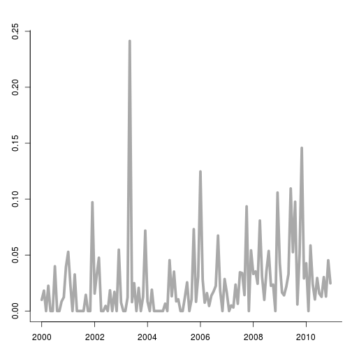
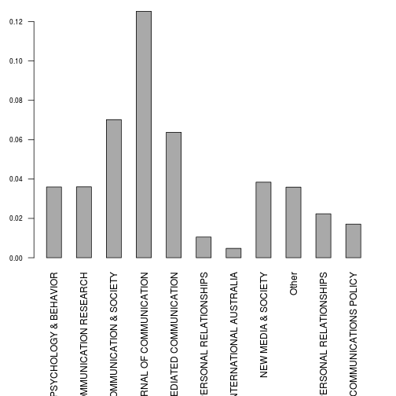
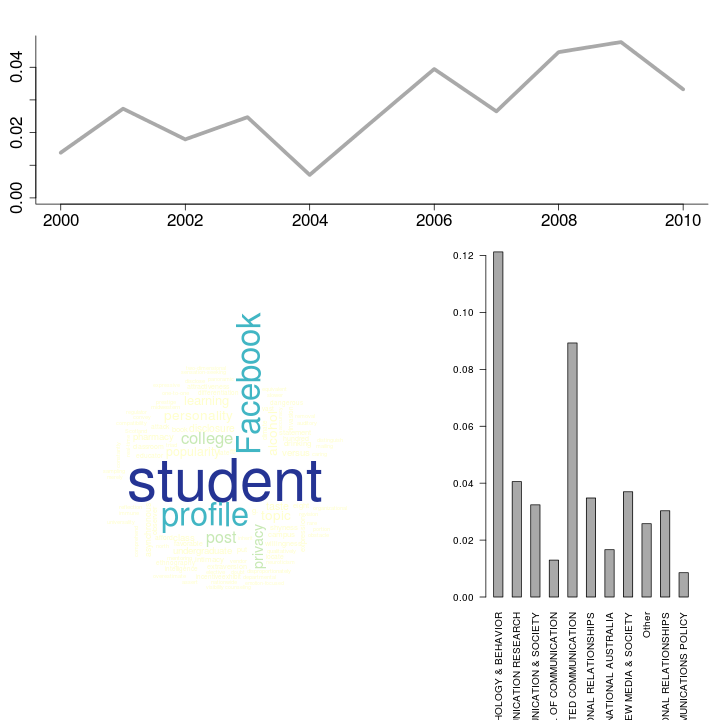
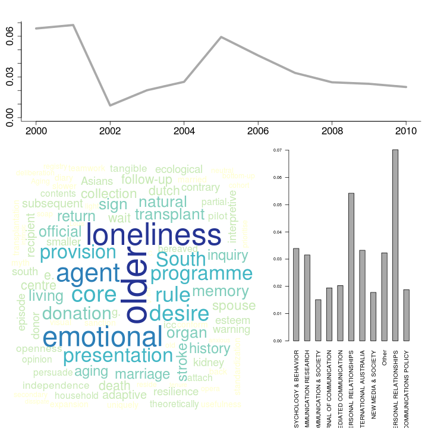
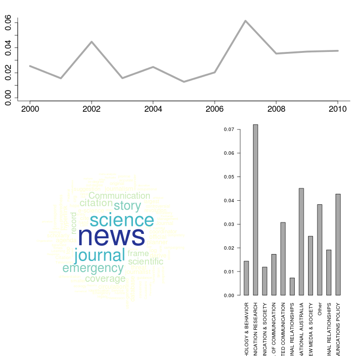

Difference howto_latent_dirichlet_allocation.Rmd and this file
========================================================
This file is almost identical to howto_latent_dirichlet_allocation.Rmd.
The difference is that this file uses the topicmodels package, whereas the other uses the lda package.
Both packages offer LDA modelling, and both have certain advanges and disadvantages.
At some point we might decide to only support one package.
Note that at present some of the code is a bit messy and redundant, since we rather hastily copy-edited some functions to work with the topicmodels package.


Latent Dirichlet Allocation
========================================================

Topic modelling techniques such as Latent Dirichlet Allocation (LDA) can be a usefull tool for social scientists to analyze large amounts of natural language data. Algorithms for LDA are available in R, for instance in the `lda` package. In this howto we demonstrate several function in the `corpustools` package that we developed to facilitate the use of LDA, based on the `lda` package.

As a starting point we use a Document Term Matrix (dtm) in the `DocumentTermMatrix` format offered in the `tm` package. Note that we also offer a howto for creating the dtm. 


```r
library(corpustools)
```

```
## Loading required package: slam
## Loading required package: Matrix
## Loading required package: lda
## Loading required package: tm
## Loading required package: reshape2
## Loading required package: topicmodels
## Loading required package: RColorBrewer
## Loading required package: wordcloud
## Loading required package: Rcpp
```

```r
load("wos_comsci_dtm.rdata")  ## Abstracts in 10 communication sciences journals from Web of Science, with 'social network' as a topic, from 2000 till 2010
dtm
```

```
## A document-term matrix (848 documents, 9753 terms)
## 
## Non-/sparse entries: 84132/8186412
## Sparsity           : 99%
## Maximal term length: 80 
## Weighting          : term frequency (tf)
```


Not all terms are equally informative of the underlying semantic structures of texts, and some terms are rather useless for this purpose. For interpretation and computational purposes it is worthwhile to delete some of the less usefull words from the dtm before fitting the LDA model. We offer the `term.statistics` function to get some basic information on the vocabulary (i.e. the total set of terms) of the corpus.


```r
termstats = term.statistics(dtm)
termstats[sample(1:nrow(termstats), 10), ]
```

```
##                                term characters number nonalpha termfreq
## purported                 purported          9  FALSE    FALSE        1
## 1995                           1995          4   TRUE    FALSE        4
## conceptualization conceptualization         17  FALSE    FALSE        9
## beneficial               beneficial         10  FALSE    FALSE       11
## 21.7                           21.7          4   TRUE     TRUE        1
## 40,000                       40,000          6   TRUE     TRUE        1
## y                                 y          1  FALSE    FALSE        2
## older                         older          5  FALSE    FALSE       45
## cdma                           cdma          4  FALSE    FALSE        1
## seminal                     seminal          7  FALSE    FALSE        1
##                   docfreq reldocfreq   tfidf
## purported               1   0.001179 0.07782
## 1995                    4   0.004717 0.03742
## conceptualization       8   0.009434 0.04978
## beneficial             10   0.011792 0.03156
## 21.7                    1   0.001179 0.03499
## 40,000                  1   0.001179 0.02181
## y                       1   0.001179 0.07483
## older                  22   0.025943 0.06509
## cdma                    1   0.001179 0.04462
## seminal                 1   0.001179 0.03845
```


We can now filter out words based on this information. In our example, we filter on terms that occur at least in two documents and that do not contain numbers. We also select only the 3000 terms with the highest tf-idf score (this is not a common standard. For large corpora it makes sense to include more terms). 


```r
termstats = termstats[termstats$docfreq > 1 & termstats$number == F, ]
voca = as.character(termstats[order(termstats$tfidf, decreasing = T), ][1:3000, 
    "term"])
filtered_dtm = dtm[, voca]  # select only the terms we want to keep
```


Now we are ready to fit the model! We made a wrapper called `topmod.lda.fit` for the `LDA` function in the `topicmodels` package. This wrapper really doesn't do anything interesting, except for deleting empty columns/rows from the dtm. The main reason for the wrapper is that we also used one for working with the other package that offers LDA modeling (for the use of the `lda.collapsed.gibbs.sampler` in the `lda` package some additional steps were required, so the wrapper makes more sense there)

The main input for `topmod.lda.fit` is:
- the document term matrix
- K: the number of topics (this has to be defined a priori)
- Optionally, it can be usefull to increase the number of iterations. This takes more time, but increases performance (to some point)


```r
m = topmod.lda.fit(filtered_dtm, K = 30, num.iterations = 1000)
terms(m, 10)[, 1:5]  # show first 5 topics, with ten top words per topic
```

```
##       Topic 1      Topic 2        Topic 3      Topic 4        Topic 5     
##  [1,] "political"  "older"        "industry"   "science"      "adolescent"
##  [2,] "blog"       "loneliness"   "digital"    "physical"     "channel"   
##  [3,] "citizen"    "emotional"    "market"     "contact"      "resident"  
##  [4,] "opinion"    "agent"        "production" "scientific"   "emergency" 
##  [5,] "democratic" "core"         "music"      "intellectual" "minority"  
##  [6,] "politics"   "desire"       "actor"      "domain"       "ethnic"    
##  [7,] "choice"     "rule"         "he"         "home"         "risk"      
##  [8,] "scholar"    "presentation" "reality"    "elderly"      "US"        
##  [9,] "preference" "programme"    "producer"   "record"       "depressive"
## [10,] "argument"   "South"        "software"   "carer"        "coordinate"
```


We now have a fitted lda model. The terms function shows the most prominent words for each topic (we only selected the first 4 topics for convenience). 

One of the thing we can do with the LDA topics, is analyze how much attention they get over time, and how much they are used by different sources (e.g., people, newspapers, organizations). To do so, we need to match this article metadata. We can order the metadata to the documents in the LDA model by matching it to the documents slot.


```r
load("wos_comsci_meta.rdata")
colnames(meta)  # the id column matches the rownames of the dtm
```

```
## [1] "id"            "date"          "journal"       "length"       
## [5] "journal.top10"
```

```r
meta = meta[match(m@documents, meta$id), ]
```


We can now do some plotting. First, we can make a wordcloud for a more fancy (and actually quite informative and intuitive) representation of the top words of a topic.


```r
topic_term_matrix = posterior(m)$terms
topics.plot.wordcloud(topic_term_matrix, topic_nr = 1)
```

 


With `topics.plot.time` and `topics.plot.category`, we can plot the salience of the topic over time and for a given categorical variable.


```r
topic_document_matrix = documentsums(m, weight.by.dtm = dtm)  # the documentsums function extracts a matrix identical to the documentsums slot of the output of the lda.collapsed.gibbs.sampler in the lda package. If the dtm is given in the weight.by.dtm parameter, then word-to-topic assignments are multiplied by the word occurence (which, I believe, is also what the lda package does)
topics.plot.time(topic_document_matrix, 1, meta$date, date_interval = "month", 
    value = "relative")
```

 

```r
# Sidenote: the `return.values` argument can be set to TRUE to also let the
# function output the values that are plotted.
```


In our example data, we can use the names of the journals as categories. However, since there are so many journals, this becomes messy. We therefore only look at the top.10 most frequent journals (in our sample) and categorize the rest as `other`.


```r
topics.plot.category(topic_document_matrix, 1, meta$journal.top10, value = "relative")
```

 

```r
# Sidenote: the `return.values` argument can be set to TRUE to also let the
# function output the values that are plotted.
```


It can be usefull to print all this information together. That is what the following function does.


```r
topics.plot.topic(document_sums = topic_document_matrix, topics = topic_term_matrix, 
    1, meta$date, meta$journal.top10, date_interval = "year", value = "relative")
```

 

```r
topics.plot.topic(document_sums = topic_document_matrix, topics = topic_term_matrix, 
    2, meta$date, meta$journal.top10, date_interval = "year", value = "relative")
```

 

```r
topics.plot.topic(document_sums = topic_document_matrix, topics = topic_term_matrix, 
    10, meta$date, meta$journal.top10, date_interval = "year", value = "relative")
```

 


Finally, with the `topics.plot.alltopics` function all topics can be visualized and saved as images. This function words the same as `topics.plot.topic`, with an additional argument to specify the folder in which the images should be saved.

