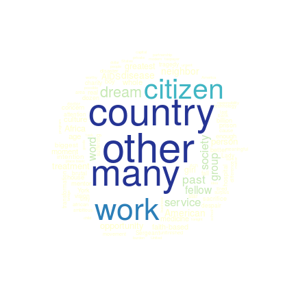
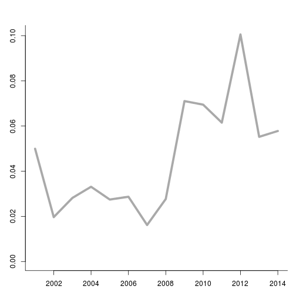
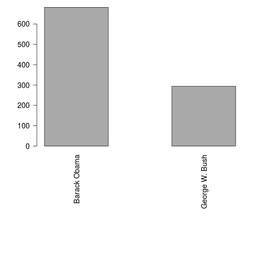
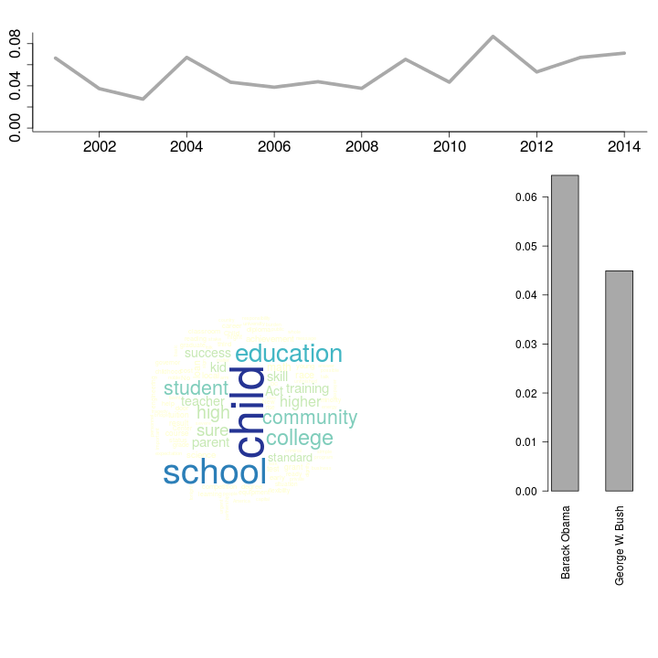
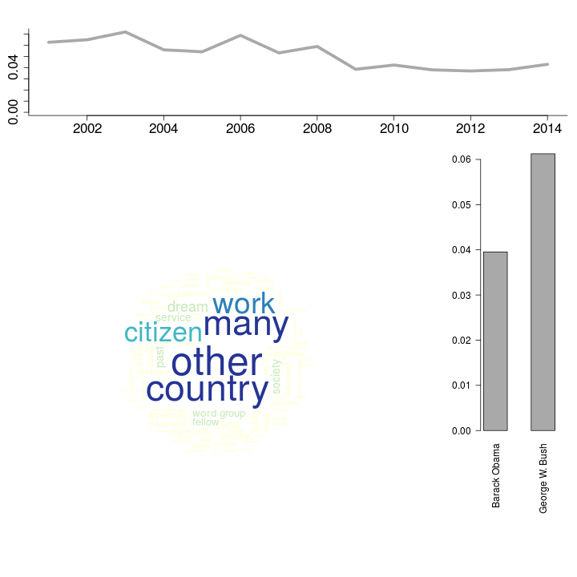

Latent Dirichlet Allocation
========================================================

Topic modelling techniques such as Latent Dirichlet Allocation (LDA) can be a usefull tool for social scientists to analyze large amounts of natural language data. Algorithms for LDA are available in R, for instance in the `topicmodels` package. In this howto we demonstrate several function in the `corpustools` package that facilitate the use of LDA using the `topicmodels` package.

As a starting point we use a Document Term Matrix (dtm) in the `DocumentTermMatrix` format offered in the `tm` package. Note that we also offer a howto for creating the dtm. 


```r
library(corpustools)
```

```
## Loading required package: slam
## Loading required package: Matrix
## Loading required package: lda
## Loading required package: tm
## Loading required package: reshape2
## Loading required package: topicmodels
## Loading required package: RColorBrewer
## Loading required package: wordcloud
## Loading required package: Rcpp
## Loading required package: igraph
```

```r
data(sotu)  # state of the union speeches by Barack Obama and George H. Bush.
head(sotu.tokens)
```

```
##         word sentence  pos      lemma offset       aid id pos1 freq
## 1         It        1  PRP         it      0 111541965  1    O    1
## 2         is        1  VBZ         be      3 111541965  2    V    1
## 3        our        1 PRP$         we      6 111541965  3    O    1
## 4 unfinished        1   JJ unfinished     10 111541965  4    A    1
## 5       task        1   NN       task     21 111541965  5    N    1
## 6         to        1   TO         to     26 111541965  6    ?    1
```

```r
sotu.tokens = sotu.tokens[sotu.tokens$pos1 %in% c("N", "M", "A"), ]  # only select nouns, proper nouns and adjectives.
dtm = dtm.create(documents = sotu.tokens$aid, terms = sotu.tokens$lemma)
dtm
```

```
## A document-term matrix (1090 documents, 3976 terms)
## 
## Non-/sparse entries: 25007/4308833
## Sparsity           : 99%
## Maximal term length: 35 
## Weighting          : term frequency (tf)
```


Not all terms are equally informative of the underlying semantic structures of texts, and some terms are rather useless for this purpose. For interpretation and computational purposes it is worthwhile to delete some of the less usefull words from the dtm before fitting the LDA model. We offer the `term.statistics` function to get some basic information on the vocabulary (i.e. the total set of terms) of the corpus.


```r
termstats = term.statistics(dtm)
head(termstats)
```

```
##                  term characters number nonalpha termfreq docfreq
## unfinished unfinished         10  FALSE    FALSE        5       5
## task             task          4  FALSE    FALSE       15      15
## basic           basic          5  FALSE    FALSE       23      23
## bargain       bargain          7  FALSE    FALSE        2       2
## country       country          7  FALSE    FALSE      228     202
## idea             idea          4  FALSE    FALSE       36      34
##            reldocfreq  tfidf
## unfinished   0.004587 0.5857
## task         0.013761 0.3172
## basic        0.021101 0.2313
## bargain      0.001835 0.6944
## country      0.185321 0.1083
## idea         0.031193 0.2277
```


We can now filter out words based on this information. In our example, we filter on terms that occur at least in five documents and that do not contain numbers. We also select only the 3000 terms with the highest tf-idf score (3000 is not a common standard. For large corpora it makes sense to include more terms). 


```r
termstats = termstats[termstats$docfreq >= 5 & termstats$number == F, ]
filtered_dtm = dtm[, termstats$term]  # select only the terms we want to keep
```


Now we are ready to fit the model! We made a wrapper called `lda.fit` for the `LDA` function in the `topicmodels` package. This wrapper doesn't do anything interesting, except for deleting empty columns/rows from the dtm, which can occur after filtering out words. 

The main input for `topmod.lda.fit` is:
- the document term matrix
- K: the number of topics (this has to be defined a priori)
- Optionally, it can be usefull to increase the number of iterations. This takes more time, but increases performance.


```r
m = lda.fit(filtered_dtm, K = 20, num.iterations = 1000)
terms(m, 10)[, 1:5]  # show first 5 topics, with ten top words per topic
```

```
##       Topic 1     Topic 2   Topic 3       Topic 4    Topic 5      
##  [1,] "child"     "other"   "life"        "program"  "people"     
##  [2,] "school"    "country" "day"         "money"    "time"       
##  [3,] "education" "many"    "man"         "system"   "first"      
##  [4,] "college"   "work"    "woman"       "Security" "same"       
##  [5,] "student"   "citizen" "hope"        "reform"   "state"      
##  [6,] "community" "dream"   "opportunity" "Social"   "strong"     
##  [7,] "high"      "past"    "progress"    "worker"   "crisis"     
##  [8,] "sure"      "service" "young"       "Medicare" "rule"       
##  [9,] "higher"    "society" "human"       "drug"     "institution"
## [10,] "parent"    "word"    "everything"  "benefit"  "spirit"
```


We now have a fitted lda model. The `terms` function shows the most prominent words for each topic (we only selected the first 5 topics for convenience). 

One of the thing we can do with the LDA topics, is analyze how much attention they get over time, and how much they are used by different sources (e.g., people, newspapers, organizations). To do so, we need to match this article metadata. We can order the metadata to the documents in the LDA model by matching it to the documents slot.


```r
head(sotu.meta)
```

```
##          id   medium     headline       date
## 1 111541965 Speeches Barack Obama 2013-02-12
## 2 111541995 Speeches Barack Obama 2013-02-12
## 3 111542001 Speeches Barack Obama 2013-02-12
## 4 111542006 Speeches Barack Obama 2013-02-12
## 5 111542013 Speeches Barack Obama 2013-02-12
## 6 111542018 Speeches Barack Obama 2013-02-12
```

```r
meta = sotu.meta[match(m@documents, sotu.meta$id), ]
```


We can now do some plotting. First, we can make a wordcloud for a more fancy (and actually quite informative and intuitive) representation of the top words of a topic.


```r
lda.plot.wordcloud(m, topic_nr = 1)
```

 

```r
lda.plot.wordcloud(m, topic_nr = 2)
```

 


With `lda.plot.time` and `lda.plot.category`, we can plot the salience of the topic over time and for a given categorical variable.


```r
lda.plot.time(m, 1, meta$date, date_interval = "year")
```

 

```r
lda.plot.category(m, 1, meta$headline)
```

 


It can be usefull to print all this information together. That is what the following function does.


```r
lda.plot.topic(m, 1, meta$date, meta$headline, date_interval = "year")
```

 

```r
lda.plot.topic(m, 2, meta$date, meta$headline, date_interval = "year")
```

 


With the `topics.plot.alltopics` function all topics can be visualized and saved as images. This function words the same as `topics.plot.topic`, with an additional argument to specify the folder in which the images should be saved.

